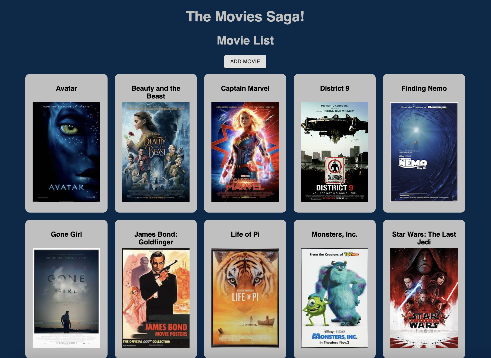
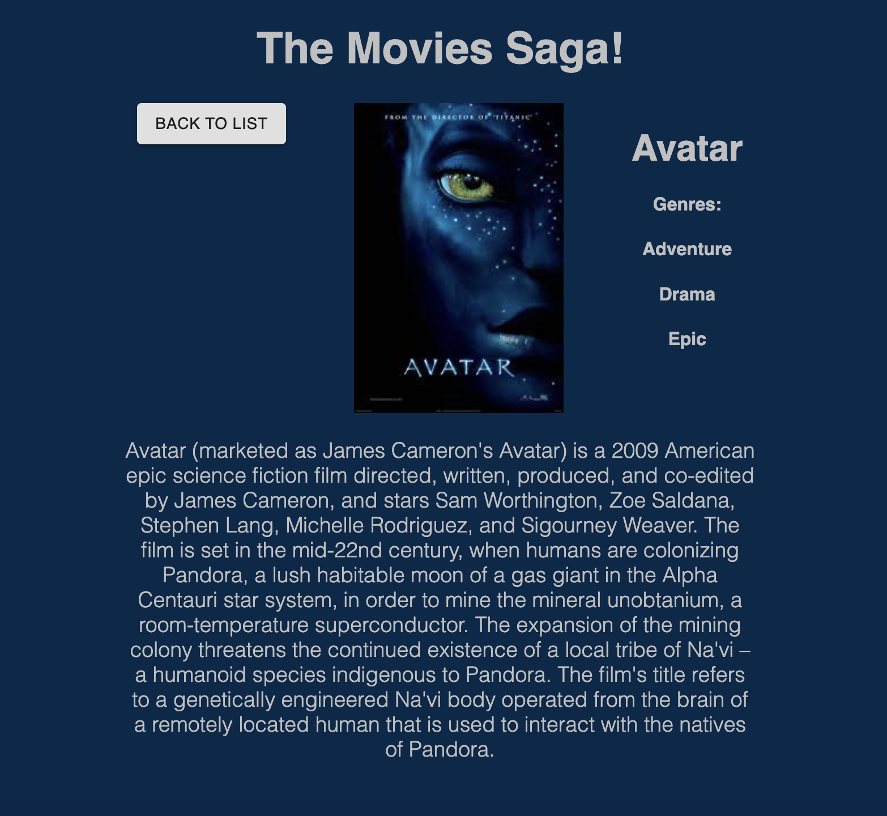
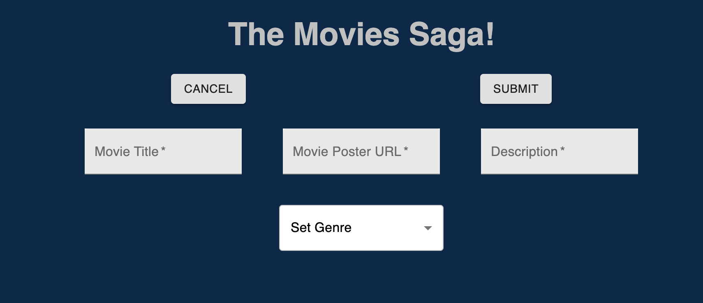

# Weekend Movie Sagas

## Description

This is an web-based list of movies that initially just lists titles and images but provides additional detailed information in a new page when they are clicked. The additional information includes genre(s) and a description. The detailed page has a back button to navigate back to the full movie list. There is also an 'Add Movie' button on top of the movie list that directs to a page where users can submit a new movie to the list. A Movie Title, Poster Image URL, Description and Genre are required before you can click the 'Submit' button. A successful submission will post the new movie information to the database and immediately render it on the movie list. There is also a 'Cancel' button that returns users to the movie list. 

## Sample Images

The Movie List/Home screen.

A Movie Details page.

The URL for each details page includes that movie's title.

The 'Add Movie' page.

## Installation
1. Fork and clone this repository.
2. Create a database named "saga_movies_weekend".
3. Run the six SQL queries in the database.sql file to set up tables and populate them with sample data. This project was made with Postgres and Postico and will work nicely with that duo.
4. From your terminal run 'npm install'.
5. Then run 'npm run server' and 'npm run client' within separate terminal instances. This should automatically open a window in your browser to the Movie List home page.

## Built With
- React
- Redux
- Saga
- Javascript
- HTML
- CSS
- Node.js
- Express
- PostgreSQL
- Material UI